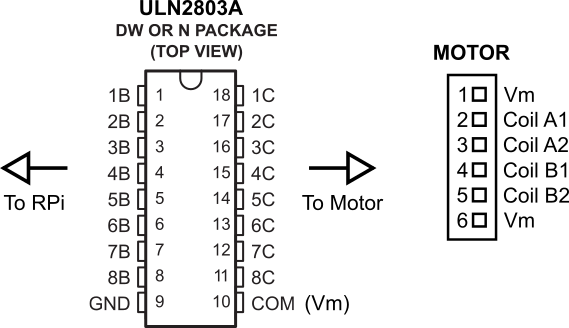

RPistepper
==========

RPistepper is a library containing: \* A class to control a stepper
motor with a RPi. \* A function to execute a zig-zag motion with two
motors. \* A function to execute a square\_spiral motion with two
motors.

Wiring
------

In our setup, the power to the motors (Vm) is supplied with the 5V pins
of the RPi, the grounding of the coils is controlled with a
`ULN2803A <http://www.ti.com/lit/ds/symlink/uln2803a.pdf>`__ transistor
array.

   Alt text

Conections RPi - ULN2803A:
^^^^^^^^^^^^^^^^^^^^^^^^^^

+-----------------+------------+
| RPi Pin (BCM)   | ULN2803A   |
+=================+============+
| 17              | 1B         |
+-----------------+------------+
| 27              | 2B         |
+-----------------+------------+
| 10              | 3B         |
+-----------------+------------+
| 9               | 4B         |
+-----------------+------------+
| 14              | 5B         |
+-----------------+------------+
| 15              | 6B         |
+-----------------+------------+
| 23              | 7B         |
+-----------------+------------+
| 24              | 8B         |
+-----------------+------------+

Conections ULN2803A - Motors:
^^^^^^^^^^^^^^^^^^^^^^^^^^^^^

+------------+---------------------+
| ULN2803A   | Motors              |
+============+=====================+
| 1C         | Motor\_1 Coil\_A1   |
+------------+---------------------+
| 2C         | Motor\_1 Coil\_A2   |
+------------+---------------------+
| 3C         | Motor\_1 Coil\_B1   |
+------------+---------------------+
| 4C         | Motor\_1 Coil\_B2   |
+------------+---------------------+
| 5C         | Motor\_2 Coil\_A1   |
+------------+---------------------+
| 6C         | Motor\_2 Coil\_A2   |
+------------+---------------------+
| 7C         | Motor\_2 Coil\_B1   |
+------------+---------------------+
| 8C         | Motor\_2 Coil\_B2   |
+------------+---------------------+

In this case, two motors were attached to the ULN2803A.

Usage
-----

class Motor
^^^^^^^^^^^

This class allows the user to control a 6 pin stepper motor using 4 GPIO
pins of a RPi.

Software uses BCM mode for pin indexing.

This class is best used with the 'with' statement to properly handle the
cleanup of the GPIOs.

self.steps is a property of this class that will get the number of steps
taken from the initial position or set to a specific step, similar to
self.move.

In order to save power, it's advised to call self.release() when the
motor is idle.

Arguments are a list with the 4 pins (Coil\_A1, Coil\_A2, Coil\_B1,
Coil\_B2), the delay between steps (default = 20ms) and verbose to
display reports on the motor movements, the last two are optional. e.g:

.. code:: python

    import RPistepper as stp
    M1_pins = [17, 27, 10, 9]
    with stp.Motor(M1_pins) as M1:
        for i in range(10):               # moves 20 steps,release and wait
            print M1
            M1.move(20)
            M1.release()
            raw_input('enter to execute next step')

If the class is instantiated normally, use the method ``cleanup`` prior
to closing the application to close the GPIO resources. Also, if it's
important to go back to the initial position when finishing the routine,
use the method ``reset``.

.. code:: python

    import RPistepper as stp
    M1_pins = [17, 27, 10, 9]
    M1 = stp.Motor(M1_pins)
    for i in range(10):               # moves 20 steps,release and wait
        print M1
        M1.move(20)
        M1.release()
        raw_input('enter to execute next step')
    M1.reset()
    M1.cleanup()

Methods
^^^^^^^

Currently there are five implemented methods:

.. code:: python

    def move(self, steps):
        '''
        Moves the motor 'steps' steps. Negative steps moves the motor backwards
        '''

.. code:: python

    def release(self):
        '''
        Sets all pins low. Power saving mode
        '''

.. code:: python

    def reset(self):
        '''
        Returns the motor to it's initial position
        '''

.. code:: python

    def zero(self):
        '''
        Sets the motor to the next position which Coil_A1 and Coil_A2
        are on. Sets this position as the reference (steps = 0).
        '''

.. code:: python

    def cleanup(self):
        '''
        Cleans the GPIO resources
        '''

The main method is ``move``, which moves the motor the desired number of
steps

steps property
^^^^^^^^^^^^^^

It's possible to check the motor position or manually set the desired
step using the ``steps`` property:

.. code:: python

    import RPistepper as stp
    M1_pins = [17, 27, 10, 9]
    with stp.Motor(M1_pins) as M1:
        for i in range(10):               # moves 20 steps,release and wait
            print M1.steps
            M1.steps = 20*i
            M1.release()
            raw_input('enter to execute next step')
        M1.reset()

Attributes
^^^^^^^^^^

This class haves the following attributes:

+-----------------+------------------------------------------------+
| Attribute       | Data                                           |
+=================+================================================+
| DELAY           | Time between steps                             |
+-----------------+------------------------------------------------+
| VERBOSE         | Display motor data on screen                   |
+-----------------+------------------------------------------------+
| PINS            | GPIOs used by the instance                     |
+-----------------+------------------------------------------------+
| actual\_state   | A list with the status of the coils (on/off)   |
+-----------------+------------------------------------------------+

functions
~~~~~~~~~

These two functions executes pre determined movements and requires two
stepper motor objects:

.. code:: python

    def zig_zag(motor1, motor2, amp1, amp2, delay=None):
        '''
        Executes a zig-zag movement with two RPistepper objects.
        Arguments are: motor1 and motor2 objects and amp1, amp2, the amplitude
        of movement, a tuple (step, rep) representing the number of steps per
        iteration and the number of iterations of the following algorithm:
            Repeat rep1 times:
                1. Moves motor 2 step2*rep2 steps forward
                2. Moves motor 1 step1 steps forward
                3. Moves motor 2 step2*rep2 steps backwards
                4. Moves motor 1 step1 steps forward
            Reset to initial state
            Release the motors
        It's possible to change the delay between steps with the 'delay' argument
        '''

.. code:: python

    def square_spiral(motor1, motor2, amplitude, delay=None):
        '''
        Executes a square spiral movement with two RPistepper objects.
        Arguments are: motor1 and motor2 objects and the amplitude of movement,
        a tuple (step, rep) representing the number of steps per iteration and
        the number of iterations of the following algorithm:
            for i in range(rep):
                1. Moves motor 2 to position i
                2. Moves motor 1 to position i
                3. Moves motor 1 to position -i
                4. Moves motor 2 to position -i
            Reset to initial state
            Release the motors
        It's possible to change the delay between steps with the 'delay' argument
        '''

/bin/rpistepper
---------------

``rpistepper`` is a shell for controlling the motors. It provides all
the methods in the ``Motor`` class. All the commands are documented in
the shell. It's possible to pipe a list of commands to the shell:

.. code:: bash

    rpistepper < sample.stp
            or
    cat sample.stp | rpistepper

Invoking ``rpistepper`` with ``-g`` flag will open a GUI application
with similar functionality
